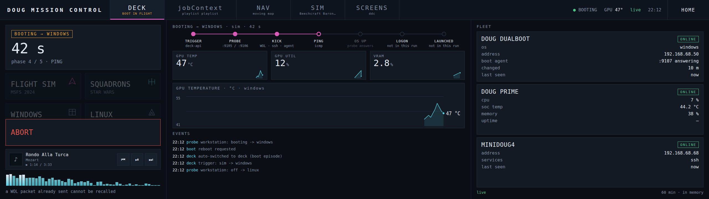
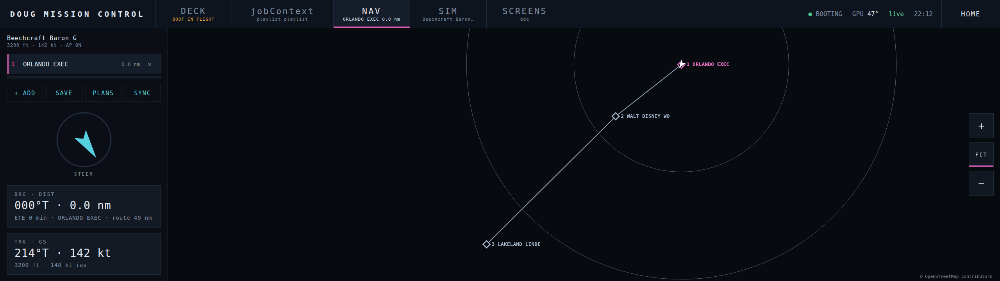
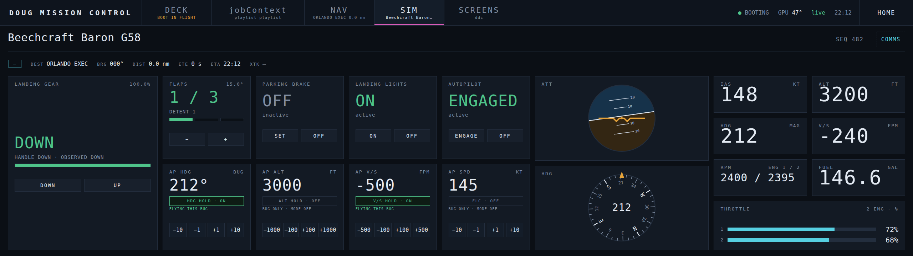
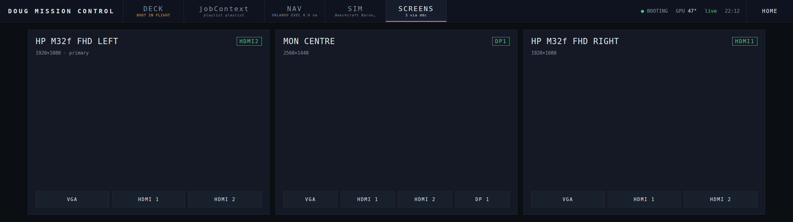

# DougMissionControl

The panel says DOUG MISSION CONTROL; so does the repo now.

Voice-controlled boot orchestration for a dual-boot workstation. Say
*"Alexa, flight sim bootup"* and the machine wakes from off, or reboots
out of Linux, lands in Windows, greets you in a neural British voice, and
launches the sim — no keyboard.

The Alexa side needs no cloud account, no skill, and no subscription: a
Raspberry Pi pretends to be a handful of Wemo smart plugs, and Alexa
routines "turn them on."

```
"Alexa, flight sim bootup"
        │
        ├─ Alexa Speaks (routine): "Right away, sir. Bringing the flight deck online."
        └─ turns on virtual device "flight sim"
                │  (fauxmo Wemo emulator on the Pi)
                ▼
        flightsim-boot.sh on the Pi probes the workstation:
                │
                ├─ Windows up   → fire greeting + launch via boot-agent /launch
                ├─ Linux up     → ssh forced-command key → grub-reboot + reboot
                └─ no answer    → WOL magic packet; if GRUB lands in Linux,
                                  chains through the ssh path
                ▼
        Windows logs on → JarvisGreeting task reads the recorded intent,
        speaks the welcome, launches the matching game.
```

## The voice commands

| Phrase (yours to choose) | Virtual device | Port | Result |
|---|---|---|---|
| "flight sim bootup" | flight sim | 49915 | Windows + MSFS 2024 |
| "boot into Windows" | pc | 49917 | Windows, greeting only |
| "squadron bootup" | squadrons | 49918 | Windows + STAR WARS Squadrons |
| "workstation bootup" | workstation | 49916 | Linux + VS Code |

Each Windows device records *why* it booted (`FLIGHT_INTENT`) to
`/tmp/flightsim-intent` on the Pi. At logon, `jarvis-greeting.ps1` reads
that back over ssh and runs the matching entry in its `$LaunchProfiles`
table — so one greeting script serves every launch profile, and a
power-button boot (no intent recorded, or one older than 30 minutes)
launches nothing.

## Layout

```
pi/setup.sh              installs fauxmo + the orchestrator on the Pi, mints the ssh key
pi/flightsim-boot.sh     the orchestrator itself (→ /usr/local/bin on the Pi)
windows/setup.ps1        WOL, Fast Startup, logon task, boot agent, firewall, token
windows/jarvis-greeting.ps1   the spoken greeting + launch profiles (logon task)
windows/boot-agent.ps1        token-guarded :9107 endpoint (SYSTEM startup task)
windows/set-primary-display.ps1  makes one monitor primary, so a profile can
                         say which screen its game opens on (`-List` to look)
linux/setup.sh           GRUB saved-default, boot-to-windows helper, WOL, greeting, media-agent
linux/boot-agent.py      token-guarded :9108 endpoint (the mirror of the Windows one)
linux/grub_utils.sh      finds the Windows menuentry (single- or double-quoted)
linux/ssh_utils.sh       installs the Pi's forced-command authorized_keys line
linux/scarlett-reset.py  USB-replug for the Focusrite after a warm dual-boot
linux/seamless-displays.sh  pins EDID + forces connectors on, so a SCREENS input
                         switch does not tear the desktop down (--revert undoes it)
linux/media-agent.py     :9110 — now-playing (MPRIS) + monitor input switching (DDC),
                         the Linux twin of the sim-agent's /media and /monitor
tests/                   shell tests for the above — `bash tests/test_*.sh`

Flight Deck — the touchscreen front-end (v0.1):
pi/display-check.sh      read-only: is the XENEON Edge's video + touch sound?
pi/setup-display.sh      cage + chromium kiosk on the Edge, mode pinning
pi/setup-deck.sh         installs deck-api, repoints fauxmo at it
pi/deck-api/deck_api.py  one entry point for every trigger; state + SSE
pi/deck-api/test_phases.py   phase mapping vs the orchestrator's real log lines
pi/deck-ui/              the panel itself — index.html, deck.css, deck.js, selftest.html
pi/deck-ui/js/           the panel as ES modules — deck.js is now just wiring:
                           format, geo, series   pure logic, unit-tested in node
                           ui                    $, rows, hold-to-arm, POST
                           track, spark, gauges  drawing, given the state to draw
                           nav, sim, screens, media   a surface each, owning its
                                                 own state and its own listeners
tools/screenshots.mjs    renders every surface at 2560x720 for the images above
                         (node + any installed Chrome + internet for map tiles;
                          `npm install playwright-core` first, `npm.cmd` on
                          Windows if PowerShell blocks the npm wrapper)

The Windows sim agent (docs/SIM-AGENT-BRIEF.md):
windows/sim-agent/       flightdeck-sim-agent — SimConnect, media, DDC, GPU
                         telemetry and the output spectrum, all on :9109
windows/setup-sim-agent.ps1   build, token, firewall, logon task
windows/scarlett-power.ps1    keep the Scarlett on the bus (power mgmt + ghosts)
```

## One-time setup (in this order)

Every address in this repo is an example — `192.168.1.50` is the
workstation, `192.168.1.51` the Pi, `192.168.100.1` a point-to-point link
to the workstation's Linux boot. Substitute your own throughout.

1. **Windows boot** (elevated PowerShell):
   ```
   powershell -ExecutionPolicy Bypass -File windows\setup.ps1 `
       -PiHost user@192.168.1.51 -AdapterName Ethernet
   ```
   — arms NIC WOL, disables Fast Startup, installs the JarvisGreeting
   logon task and the boot agent, prints the agent token and a BIOS +
   auto-logon checklist. `-PiHost` is baked into the installed greeting so
   it can read back which trigger caused the boot; a re-run without it
   keeps the value already installed.
2. **Pi** (from either boot):
   ```
   PI_HOST=user@192.168.1.51 PI_LAN_IP=192.168.1.51 \
   WS_LAN=192.168.1.50 WS_MAC=AA:BB:CC:DD:EE:FF \
   WS_BROADCAST=192.168.1.255 LINUX_SSH=user@192.168.100.1 ./pi/setup.sh
   ```
   — installs fauxmo and the orchestrator, writes those values to
   `/etc/flightsim/boot.env`, prints the Pi's public key. Add the token
   from step 1 to that file as `WIN_AGENT_TOKEN=`. The env file is the
   one place to correct an address later; re-runs keep your edits.
3. **Linux boot** (sudo, with the key from step 2):
   `sudo ./linux/setup.sh 'ssh-ed25519 AAAA… flightsim-boot@pi'`
   — GRUB_DEFAULT=saved, the `boot-to-windows` helper, the forced-command
   authorized_keys entry, persistent `ethtool wol g`, the `:9108` boot
   agent, and the Linux logon greeting + VS Code autostart. It prints a
   `LINUX_AGENT_TOKEN=` line; add that to `boot.env` on the Pi too. The
   public key is optional — omit it to install everything except the ssh
   path, and the Pi will use the token-guarded agent instead.
4. **BIOS**: enable "Resume by PCI-E/PME" (Wake on LAN) and **disable**
   ErP/EuP deep-off, or the NIC loses standby power at S5 and cold-boot
   wake silently fails.
5. **Auto sign-in** (needed for a truly hands-free cold boot — the
   greeting and launches are logon-triggered): `netplwiz` → uncheck
   "Users must enter a user name and password". On Windows 11 that
   checkbox is hidden until you set
   `HKLM:\SOFTWARE\Microsoft\Windows NT\CurrentVersion\PasswordLess\Device`
   → `DevicePasswordLessBuildVersion` = 0. Sysinternals Autologon also
   works and ignores the whole dance.
6. **Alexa app**: "Alexa, discover devices" finds the virtual plugs
   (they appear under Plugs). Then More → Routines → **+** → When:
   *Voice* → your phrase → Action 1 *Alexa Says* (your Jarvis line) →
   Action 2 *Smart Home* → the device → **On**.

## Flight Deck — the touchscreen (v0.1)

A Corsair XENEON Edge (2560 × 720, HDMI + USB HID touch) on the Pi, giving
the same four triggers a physical panel — plus the thing voice cannot: a
live picture of the ninety seconds after you ask. It hangs off the Pi rather
than the workstation, because the workstation is the subject of every
control on it.

```
./pi/display-check.sh          # prove video + touch; fix every ✗ before continuing
sudo ./pi/setup-display.sh     # cage + chromium kiosk, opens the touch self-test
sudo ./pi/setup-deck.sh        # deck-api on :8088, repoints fauxmo, real UI
```

`flightsim-boot.sh` is **not modified**. `deck-api` triggers it exactly as
fauxmo always has and derives boot phases by following the script's own
`journalctl -t flightsim-boot` output, so a boot started by voice, by touch,
or by hand all show up the same way.

| | |
|---|---|
| `GET /api/state` | everything the panel renders |
| `GET /api/events` | the same, streamed over SSE |
| `POST /api/boot` | `{"intent":"sim\|squadrons\|plain\|code"}` |
| `POST /api/launch` | target already up — fire greeting + profile |
| `POST /api/abort` | kill an in-flight run |
| `POST /api/hook/greeting` | for the Windows callback; not wired in v0.1 |

Loopback needs no token; anything else needs `DECK_TOKEN` from
`/etc/flightsim/boot.env`. Phases 6–7 (LOGON, LAUNCHED) stay dark until
`jarvis-greeting.ps1` gains a callback — nothing on the Windows side is
touched, so a run completes at **OS UP**.

### The surfaces

Five surfaces behind a persistent 72 px strip, all of them live at once —
nothing is unmounted when you look away, because reloading the Grafana frame
would restart the playlist every time you glance at DECK.

These are rendered from the real `deck-ui` at true panel pixels by
`tools/screenshots.mjs`, against a scripted state frame. They are what the
panel looks like, not a mock-up, and they can be regenerated after any change.

**DECK** — the boot you just asked for, while it happens. Phase track,
rolling GPU telemetry, the fleet, and an ABORT that only appears with a boot
in flight.



**NAV** — a moving map from the sim agent's observed position. Waypoint
search hits real OpenStreetMap data, plans are saved on the Pi, and the trail
is where the aircraft has actually been. Pinch to zoom; FIT hands framing back
to the auto-fit.



**SIM** — observed aircraft state and the controls that command it. The panel
never draws the commanded state: a tap shows PENDING over the last *observed*
value, and only the simulator moving it changes what you see. That is what
makes a command MSFS ignored look like a failed command instead of a lie.

Each autopilot bug carries the mode that reads it. A bug on its own is only a
target — set AP SPD to 165 with no mode engaged and the throttle never moves —
so the tile says *FLYING THIS BUG* or *BUG ONLY · MODE OFF* rather than leaving
a number sitting there looking authoritative.



**SCREENS** — one card per monitor, named by its position on the desk, with a
button per input the panel declares. DDC/CI over whichever OS is booted:
Windows answers through the sim agent, Linux through `media-agent.py`.

Panels that won't declare their inputs — the HP 32f refuses the capabilities
request outright — fall back to `MON_DEFAULT_INPUTS`, an operator-stated fact
about this desk rather than a guess from a model table. Whatever that list
says, the input a monitor is *observed on* is always offered too: a default
written for two identical HPs mentions no DisplayPort, and without that rule
the panel could move a third monitor to HDMI with no button anywhere to bring
it back.



**jobContext** — the pre-existing Grafana wallboard, framed as-is. Flight Deck
provisions no dashboards, stores no eval data, and contributes only the strip,
the sub-nav built from Grafana's own dashboard list, and AUTO pinning.

*Not shown: the frame's contents are third-party software that is not part of
this repo, and a screenshot of a stand-in would document nothing real.*

### Live telemetry, and only live

GPU temperature, utilisation and VRAM come from the exporters that already
answer on `:9105` / `:9106` — this project installs none of its own. deck-api
parses what they emit and keeps **only the latest value**; the rolling
60-minute window behind the sparklines lives in the browser's memory and dies
with the page.

There is deliberately no Prometheus, Grafana, Loki, or long-term retention.
This targets the existing Pi 4B with 4 GB and a USB thumb drive, and a TSDB
on flash with no real wear levelling corrupts before it dies. deck-api state
lives in tmpfs and `/tmp` is moved there too, so nothing writes in a loop.

When neither OS answers, the trace breaks rather than reading zero — on a
dual-boot machine that gap *is* the reboot.

Both `pi/deck-api/test_phases.py` and `test_telemetry.py` run anywhere, with
no Pi and no exporter needed. See [docs/DESIGN.md](docs/DESIGN.md) for the
full picture.

## Configuration

Most values live in `/etc/flightsim/boot.env` on the Pi (created by
`pi/setup.sh`, never overwritten):

| Variable | Meaning |
|---|---|
| `WS_LAN` | workstation's LAN IP — must be the same under both OSes (DHCP reservation by MAC) |
| `WS_MAC` | that NIC's MAC, the WOL target |
| `WS_BROADCAST` | subnet broadcast address for the magic packet |
| `LINUX_SSH` | user@host for the Linux boot (a direct-link IP is fine) |
| `WIN_AGENT_TOKEN` | must match `C:\ProgramData\dualboot\boot-agent.token` |
| `LINUX_AGENT_TOKEN` | must match `/etc/flightsim/boot-agent.token` on the Linux boot. Unset means every reboot-to-Windows request goes over the ssh key instead |
| `LINUX_AGENT_PORT` | the Linux boot agent's port (default 9108) |
| `LINUX_MEDIA_TOKEN` | must match `/etc/dualboot/media-agent.token` on the Linux boot. Unset means MEDIA and SCREENS stay dark under Linux — deck-api skips the agent entirely rather than guessing |
| `LINUX_MEDIA_PORT` | the Linux media/monitor agent's port (default 9110) |
| `SIM_AGENT_TOKEN` | must match `C:\ProgramData\dualboot\sim-agent.token`. The same token guards SIM, MEDIA and SCREENS under Windows — one agent serves all three |
| `SIM_AGENT_PORT` | the Windows sim agent's port (default 9109) |
| `POLL_SECS` | how long to keep watching a boot (default 300) |

Hardcoded elsewhere and worth knowing about: the Pi's address in
`jarvis-greeting.ps1` (for the intent read-back), the device names and
ports in `pi/setup.sh`, and the launch commands in `$LaunchProfiles`.

### Adding a game

Three edits: a new device block in `pi/setup.sh` with
`FLIGHT_INTENT=<key>`, a matching entry in `$LaunchProfiles` in
`windows/jarvis-greeting.ps1` (command plus the Jarvis closing line), then
redeploy both sides, re-run Alexa discovery, and add a routine.

### Choosing which screen a game opens on

A launch profile can also say what the desk should look like before the game
starts. Both fields are optional, and a profile with neither leaves everything
exactly as it found it:

```powershell
sim = @{
    cmd     = { explorer.exe shell:AppsFolder\Microsoft.Limitless_8wekyb3d8bbwe!App }
    display = '3840x1080'      # make this monitor primary first
    input   = 'dp1'            # and put every monitor on this DDC input
    closing = 'The flight deck is ready when you are.'
}
```

`display` exists because both of these games take the **primary display and
nothing else** — Squadrons is Frostbite and has no monitor picker at all — so
"launch on the ultrawide" really means "make the ultrawide primary first".
Windows has no cmdlet for that; `set-primary-display.ps1` does it through
`ChangeDisplaySettingsEx`, moving the new primary to the origin and carrying
every other monitor with it so the desktop does not end up with a hole in it.
Run it with `-List` to find a string that identifies the panel you mean:

```powershell
C:\ProgramData\dualboot\set-primary-display.ps1 -List
```

Matching is deliberately strict about ambiguity — two identical 1920×1080
panels both match `1920x1080`, and it will refuse rather than pick one, because
making the wrong monitor primary rearranges the whole desktop.

`input` switches DDC through the sim agent already running on the box, the same
endpoint the SCREENS surface drives, so there is exactly one implementation of
DDC on this machine. Leave it unset unless you know which input your PC is on:
sending a monitor to an input nothing is plugged into blanks it until you find
the OSD.

Neither can stop a launch. A monitor that will not move is a worse evening than
a game on the wrong screen, and both failures are warnings that the greeting
carries on past.

## How "is it up?" is decided

The orchestrator probes two Prometheus exporters that belong to a
separate project (a Grafana wallboard): `:9105` answering means Linux,
`:9106` means Windows. This repo does not install them — if you run
this without that stack, repoint `WIN_PORT`/`LINUX_PORT` at
anything that answers HTTP only under the OS in question.

The two boot agents are the better answer, and need no code change to use:
the probe hits the root path, and both agents answer `/` as well as
`/status`, so `WIN_PORT=9107` and `LINUX_PORT=9108` in `boot.env` are all
it takes. Both ship with this repo, both run from startup rather than at
logon, and both are more reliable than the exporters — which belong to
another project and have died on their own more than once.

### GPU telemetry

The DECK gauges used to come only from that same third-party exporter, so each
time it died the panel reported "no data" about a GPU sitting there at 47°.
The sim agent now serves its own `/metrics` from `nvidia-smi`, and deck-api
prefers it under Windows, falling back to `WIN_METRICS_URL` when it is absent —
so a deployment without the agent behaves exactly as it always did.

This introduces no metrics stack: no Prometheus, no retention, no second
scrape history. It is the current reading, in exposition format only because
deck-api already parses that shape, which made the Pi-side change a URL
preference rather than a new parser. The rolling window the sparklines draw
still lives in the browser and still dies with the page.

### The visualiser

`GET /api/audio` returns 48 spectrum bands measured on the workstation by the
sim agent's WASAPI loopback capture, and the DECK rail draws them under the
now-playing widget. It is loopback on the default *render* endpoint, so it
needs no virtual cable and changes nothing about what reaches the Scarlett.

The bands are real. There is no fallback pattern and no idle animation: when
nothing is playing the bars are flat, and when there is no capture session the
widget is hidden entirely. A visualiser driven by track position or a canned
waveform would be the same class of lie as drawing a commanded gear position,
which is the one thing this panel refuses to do anywhere else.

Note what a failed probe does *not* distinguish: a machine that is off,
a machine asleep ignoring magic packets, and a machine that is up with a
dead exporter all look identical from the Pi. All three log
`no response — sending WOL`. If a trigger reaches the Pi and nothing
boots, check whether the machine was merely asleep before suspecting
fauxmo — see the WOL note in Troubleshooting.

## Tests

```
bash tests/test_*.sh          # all of them; each is standalone
python3 pi/deck-api/test_phases.py
```

| Suite | Covers |
|---|---|
| `tests/test_boot_agent.sh` | the Linux boot agent's auth matrix, against a real listener on a throwaway port with a stubbed reboot |
| `tests/test_grub_entry.sh` | finding the Windows menuentry in single- and double-quoted `grub.cfg` |
| `tests/test_media_agent.sh` | `ddcutil` parsing against the layouts it really emits, that an empty monitor list explains itself, and that each SCREENS card commands its own panel rather than its neighbour |
| `tests/test_deck_ui.sh` | the panel's pure logic in node — formatting, map arithmetic, the teleport threshold, and the rolling telemetry window |
| `tests/test_sim_agent.sh` | which sim event each Flight Deck command resolves to and with what parameter, and that every autopilot bug publishes the mode that reads it |
| `pi/deck-api/test_phases.py` | phase mapping against the orchestrator's real log lines |

`test_deck_ui.sh` skips cleanly where node is absent; the Pi runs the panel in
Chromium and has no reason to have node installed. `test_sim_agent.sh` skips
the same way without the .NET SDK, and needs neither Windows nor the MSFS SDK
where it does run — it builds the agent against its SimConnect stub and
reflects into the result.

The sim-agent suite is aimed at one failure mode in particular: a command that
compiles, transmits, is reported accepted, and does nothing, because the number
in it was right-looking and wrong. `FLAPS_SET` taking a 0–16383 handle position
rather than the detent index it is invariably handed is exactly that, and it
sent every flap command on the panel to UP.

The UI suite is deliberately weighted toward the failures this panel has
actually had, rather than toward coverage: a trail drawn straight across a
relocate, a sparkline carrying a value through an outage instead of showing a
hole, an ETE invented from a ground speed too small to divide by, and a
missing reading rendered as a zero.

## Test matrix

| Starting state | Expect |
|---|---|
| Target OS already up | greeting + launch fire immediately, no reboot |
| Other OS up | reboot into the target in ~30 s, greeting on logon |
| Powered off | WOL powers on; straight to the GRUB default, else one chained reboot (~2 min) |

WOL cannot pick a GRUB menu entry, so from full-off the machine always
lands in the saved default first. Keep Linux as the default (needed for
the Windows→Linux leg to work at all) or flip it to Windows for faster
cold sim starts — not both.

## Troubleshooting

- **Alexa: "device isn't responding" / nothing reaches the Pi.** Check the
  Echo is on the same subnet as the Pi — a roaming Echo that rejoined a
  different SSID is the usual cause. `journalctl -u fauxmo` shows whether
  any probe arrived at all.
- **Alexa: "encountered a hardware malfunction".** Alexa polls device
  state right after turning it on; a boot takes minutes. The `state_cmd`
  therefore also reports ON while the boot lock is held.
- **Echo won't discover the devices.** fauxmo must answer on the Echo's
  subnet; retry discovery, and note newer Echo firmware can be picky about
  Wemo emulation. There is no "Wemo" entry under *Add device → Other* on
  current app versions — plain "discover devices" is the reliable path.
- **`cannot execute: required file not found` on the Pi.** A CRLF checkout
  broke the shebang. `.gitattributes` pins `*.sh` to LF and `pi/setup.sh`
  strips CR on install; if you hit it anyway, `sed -i 's/\r$//'`.
- **The Pi can't reach `:9107`.** The firewall rule must cover the profile
  Windows assigns your LAN — it is often *Public*, not *Private*, and a
  Private-only rule fails silently.
- **WOL does nothing from full off.** BIOS PME disabled, ErP deep-off
  enabled, or the last shutdown was from Linux without
  `flightsim-wol.service` armed. A lit link LED while off means standby
  power is present.
- **WOL does nothing from sleep**, though it works from full off. A
  different problem with the same symptom, and the one that silently
  breaks scheduled boots. On Windows check `powercfg /a`: "Standby (S0 Low
  Power Idle)" means Modern Standby, where wake-on-magic-packet is
  unreliable by design — switch the BIOS to S3 if it offers the choice, or
  set sleep to Never on a machine whose whole job is being summonable.
  `powercfg -devicequery wake_armed` must list the NIC; if it does not,
  the `powercfg /deviceenablewake` grant did not stick. Under Linux,
  `ethtool <iface>` should report `Wake-on: g`.
- **Alexa acknowledges, the Pi logs the trigger, and nothing boots.** Read
  past the generic `WARN: reboot request failed` — it covers ssh auth
  failure, an unreachable host, and a token rejection alike. Run the
  reboot leg by hand from the Pi and read the real error. A `Permission
  denied (publickey)` here usually means `LINUX_SSH` names the wrong
  account: it must be the *workstation's* username, which is easy to
  confuse with the Pi's own.
- **Machine wakes but nothing is spoken.** Nobody logged on — the greeting
  is a logon task. See auto sign-in above.
- Logs: `journalctl -t flightsim-boot` on the Pi (plus
  `~/flightsim-boot.log` for detached runs).

## Security notes

- There are two ways to reboot the workstation into Windows, and both are
  credential-guarded. The Pi's ssh key is bound in `authorized_keys` to
  `command="sudo /usr/local/bin/boot-to-windows"` with `restrict`, and the
  sudoers rule covers exactly that one script — the key can reboot the box
  into Windows and nothing else. The Linux boot agent on `:9108` is the
  faster path and needs `LINUX_AGENT_TOKEN`; the orchestrator tries it
  first and falls back to the ssh key when no token is configured or the
  agent does not answer.
- Both boot agents fail closed. A wrong token gets a 403, and a missing or
  empty token file refuses `/reboot` outright rather than degrading to "no
  token required" — so a half-finished install cannot leave an
  unauthenticated reboot endpoint listening on the LAN.
- The Pi does hold both agent tokens, in `/etc/flightsim/boot.env`. They
  are reboot-only credentials: neither agent exposes a shell, a file
  transfer, or any command beyond the reboot it was built for. `/status`
  and `/` are unauthenticated on both, being reads.
- The Windows agent runs as SYSTEM (it must reboot before anyone logs on).
  Both are hand-rolled HTTP listeners on LAN ports — fine behind a home
  router, not something to expose to the internet.
- fauxmo is LAN-only, "off" is a deliberate no-op, and the state probe is
  a read.
- No secrets in the repo. Both agent tokens are generated at install time,
  and `.gitignore` covers `*.token`.

## Origin

Extracted from a job-search project's `scripts/flightsim/` directory,
where it was living for no better reason than that's where it got
written. History preserved via `git subtree split`. Internal identifiers
keep the `flightsim` prefix (`/etc/flightsim`, `flightsim-boot.sh`, the
`FlightSimBootAgent` task) because renaming them would mean reinstalling
every deployed piece.

## License

MIT — see [LICENSE](LICENSE).
